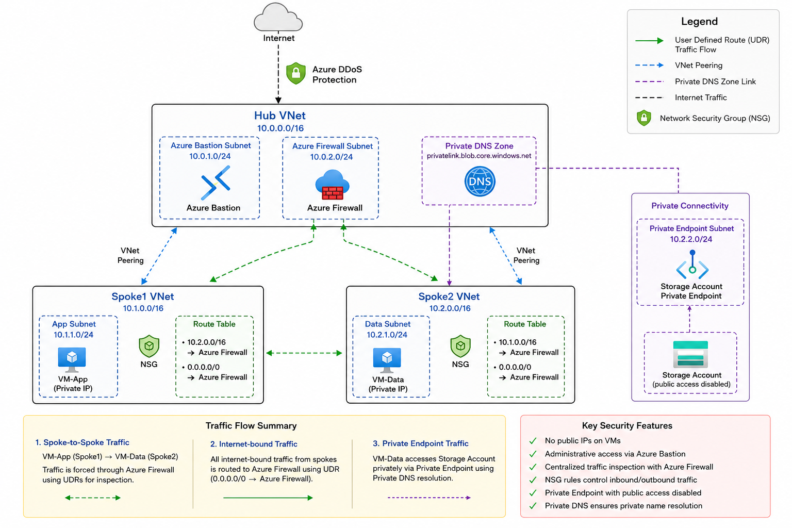
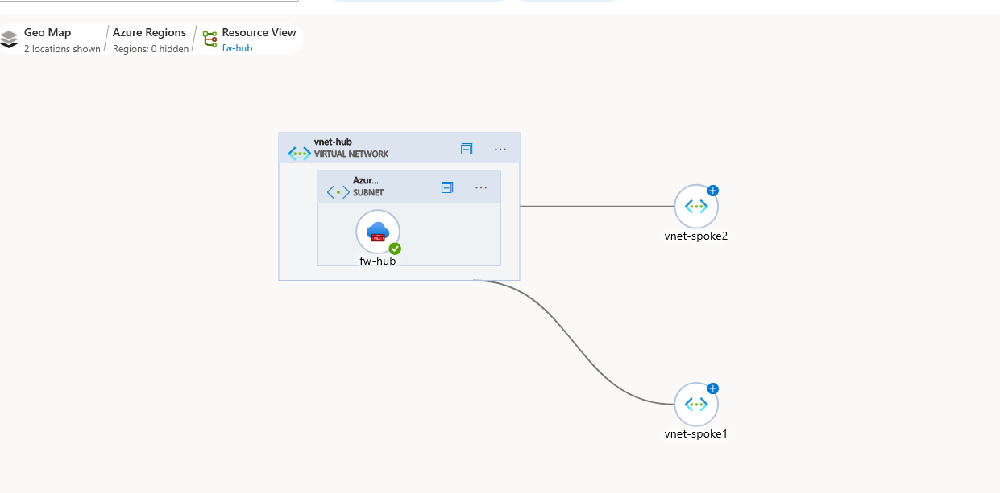
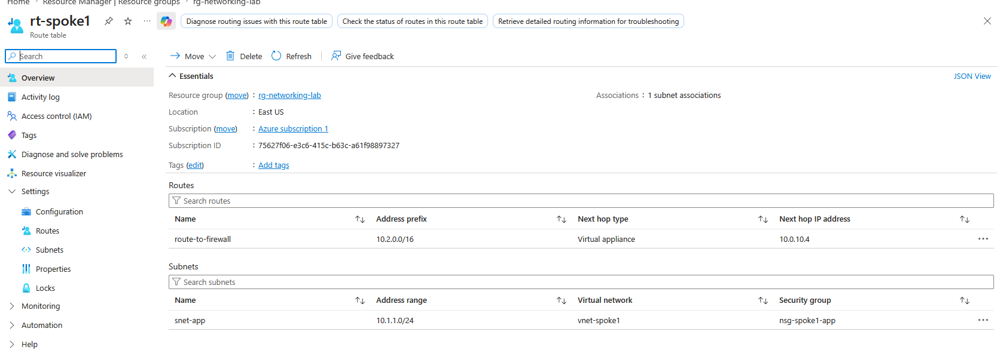

# Azure Networking Deep Dive — Enterprise Hub & Spoke Architecture with Terraform

## Project Overview

This project demonstrates a production-style Azure networking environment built entirely with Terraform using a modular Infrastructure-as-Code architecture.

The primary goal of this lab was to gain hands-on experience with enterprise Azure networking concepts including:

* Hub-and-spoke networking
* Azure Firewall
* User Defined Routes (UDRs)
* Network Security Groups (NSGs)
* Azure Bastion
* Private Endpoints
* Private DNS Zones
* East-west traffic flow
* Layered network security
* Terraform module design
* Azure networking troubleshooting

This project focused heavily on understanding **how Azure traffic flows through enterprise environments** rather than simply deploying resources.

---

# Architecture Diagram





---

# Technologies Used

## Infrastructure as Code

* Terraform
* AzureRM Provider

## Azure Services

* Azure Virtual Networks
* Azure VNet Peering
* Azure Firewall
* Azure Bastion
* Azure Route Tables (UDRs)
* Azure Network Security Groups
* Azure Linux Virtual Machines
* Azure Private Endpoints
* Azure Private DNS Zones
* Azure Storage Accounts

---

# Project Goals

This environment was designed to simulate real-world enterprise Azure networking patterns such as:

* Centralized hub-and-spoke architecture
* Segmented workloads
* Secure administrative access
* Private-only infrastructure
* Centralized traffic inspection
* Explicit traffic routing
* Private PaaS connectivity
* Layered network security

---

# Terraform Architecture

The infrastructure was built using reusable Terraform modules.

## Project Structure

```text
azure-networking-deep-dive/
│
├── main.tf
├── variables.tf
├── outputs.tf
├── providers.tf
├── terraform.tfvars.example
├── .gitignore
│
├── modules/
│   ├── networking/
│   ├── nsg/
│   ├── vm/
│   ├── bastion/
│   ├── firewall/
│   ├── route-table/
│   ├── storage/
│   └── private-endpoint/
│
├── diagrams/
│
└── screenshots/
```

---

# Networking Design

## Hub VNet

The hub network acts as the centralized networking layer and contains:

* Azure Firewall
* Azure Bastion
* Shared services
* Centralized routing

## Spoke VNets

Separate spoke VNets simulate segmented workloads:

| VNet   | Purpose              |
| ------ | -------------------- |
| Spoke1 | Application workload |
| Spoke2 | Data workload        |

This architecture mirrors common enterprise Azure network segmentation patterns.

---

# Key Concepts Learned

## 1. Non-Transitive VNet Peering

One of the most important lessons from this project was understanding that:

```text
VNet peering does NOT automatically provide transit routing.
```

Even though:

* Spoke1 was peered to the Hub
* Spoke2 was peered to the Hub

Spoke1 could NOT directly communicate with Spoke2 without additional routing configuration.

This demonstrated the importance of:

* User Defined Routes (UDRs)
* Centralized firewalls
* Explicit traffic engineering

---

## 2. Bastion vs Workload Traffic

Azure Bastion successfully allowed secure administrative access to private VMs without exposing public IP addresses.

However, Bastion did NOT provide workload-to-workload connectivity between spokes.

This reinforced the distinction between:

| Plane            | Purpose                      |
| ---------------- | ---------------------------- |
| Management Plane | Administrative access        |
| Data Plane       | Application/workload traffic |

---

## 3. User Defined Routes (UDRs)

Custom route tables were implemented to override Azure’s default routing behavior and force traffic through Azure Firewall.

This demonstrated:

* Next-hop routing
* Forced tunneling
* Centralized traffic inspection
* Enterprise traffic engineering

---

## 4. Azure Firewall Concepts

Azure Firewall was deployed as a centralized security and routing layer.

This lab explored:

* Firewall rule collections
* East-west traffic inspection
* Transit routing concepts
* Layered network security

---

## 5. Private Endpoints & Private DNS

A private endpoint was created for Azure Storage to eliminate public exposure.

The storage account was configured with:

```hcl
public_network_access_enabled = false
```

Private DNS Zones were then linked to the VNets to allow private name resolution.

This demonstrated:

* Private-only PaaS access
* DNS override behavior
* Enterprise zero-trust concepts

---

# Troubleshooting & Lessons Learned

This project included multiple real-world troubleshooting scenarios.

## Spoke-to-Spoke Traffic Failure

Initially:

* SSH between spokes failed
* TCP connectivity timed out

Root cause:

* Hub VNet was not acting as a transit router
* Peering alone did not provide transitive routing

This reinforced the importance of:

* UDRs
* Centralized routing
* Explicit traffic paths

---

## Firewall & Routing Troubleshooting

Troubleshooting included:

* Effective Routes analysis
* Route Table validation
* Firewall rule validation
* NSG verification
* Packet flow reasoning

This significantly improved understanding of layered network troubleshooting.

---

## Private DNS Resolution Issue

Initially, the storage account resolved to a public IP address.

Root cause:

* Private DNS Zone was linked only to the Hub VNet
* Spoke VNets were not linked

After linking the spoke VNets to the Private DNS Zone, name resolution correctly returned a private IP address.

This demonstrated the importance of:

* DNS scope
* VNet DNS linkage
* Private Endpoint integration

---

# Security Design

The environment was intentionally designed using security-first principles:

* No public IPs on VMs
* Secure access through Azure Bastion
* NSG-based segmentation
* Private Endpoint architecture
* Public access disabled on Storage Accounts
* Centralized traffic control concepts
* Layered network security

---

# Deployment

## Initialize Terraform

```bash
terraform init
```

## Review Infrastructure Plan

```bash
terraform plan
```

## Deploy Infrastructure

```bash
terraform apply
```

---

# Destroy Infrastructure

To avoid unnecessary Azure costs:

```bash
terraform destroy
```

---

# Future Improvements

Potential future enhancements include:

* Remote Terraform state backend
* GitHub Actions CI/CD pipeline
* Azure Policy integration
* Azure Monitor & Log Analytics
* Hybrid VPN connectivity
* Firewall diagnostics & logging
* AKS networking integration
* Application Gateway / WAF

---
# Screenshots

## Azure Hub & Spoke Topology



---

## Effective Route Table

Traffic is forced through Azure Firewall using User Defined Routes (UDRs).



---

---

# Final Thoughts

This project significantly improved my understanding of:

* Azure networking architecture
* Terraform modular design
* Routing behavior
* Private connectivity
* Enterprise cloud security
* Infrastructure troubleshooting methodology

The biggest takeaway from this project was learning how to think in terms of:

```text
packet flow
routing behavior
traffic engineering
security layers
```

rather than simply deploying cloud resources.
